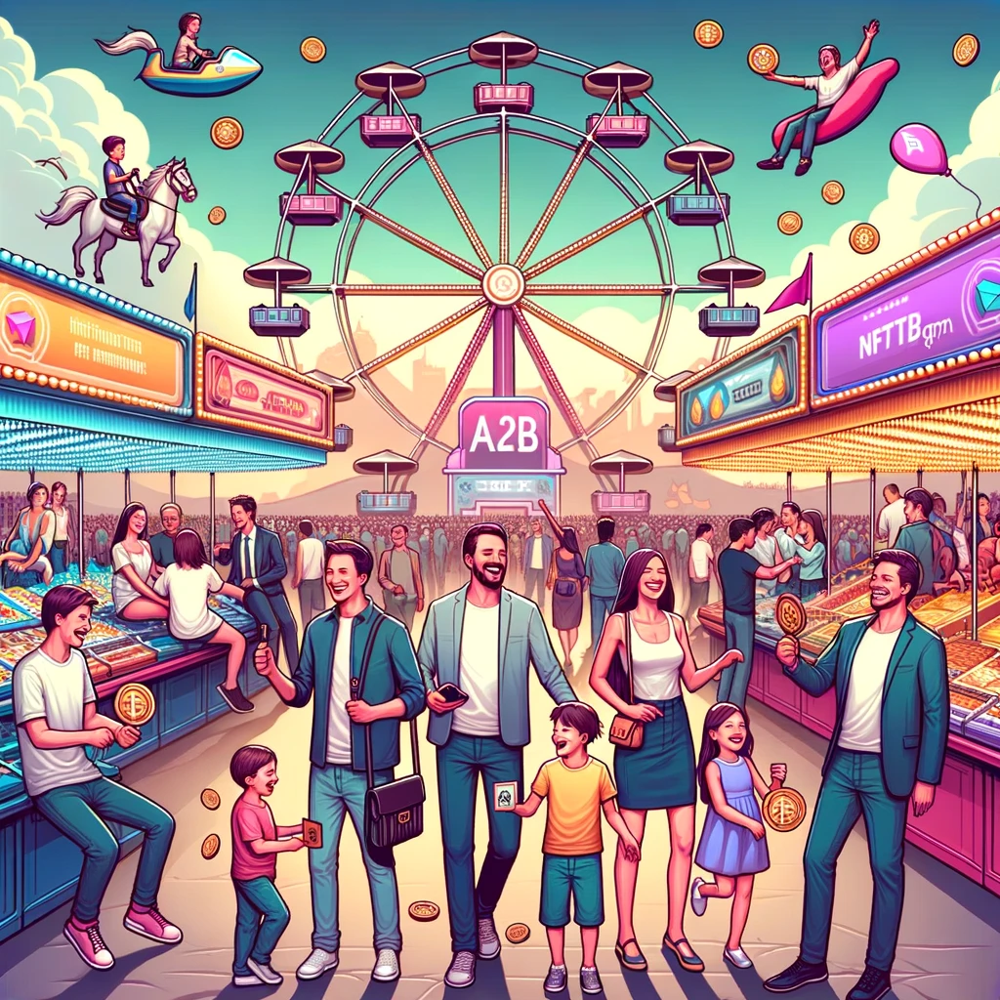
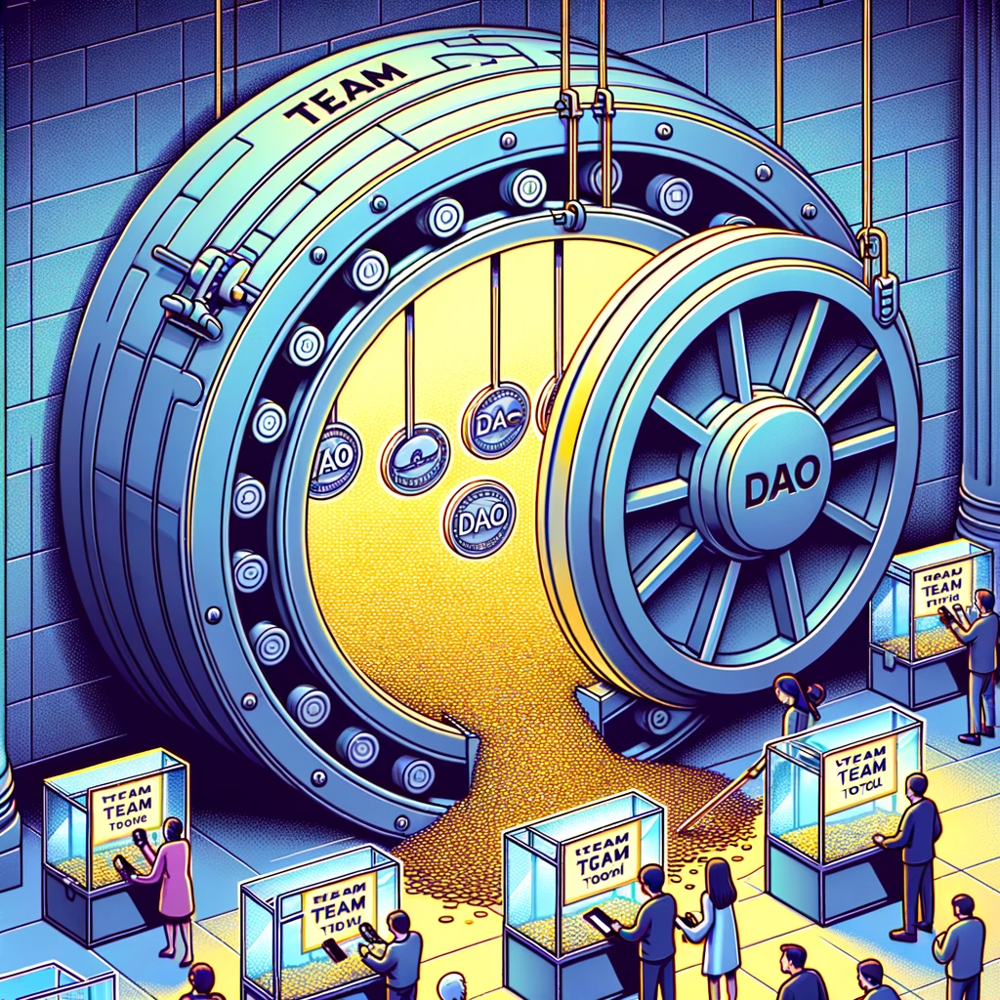

# Dive into the Tokenomics 🪙

Ever wondered about the magic behind the scenes? Let's unwrap the wizardry of our tokenomics, designed not just for the moon, but for the entire crypto community! 🌌

### **Fee-tastic Trade-offs** 💰:

* Engage with the bot and expect a tiny trade fee ranging from 0.5% to 1%. It's just how we keep the lights on and the magic running.
* Now, for the A2B tokens and A2B DAO NFTs? There's a 4% tax:
  * 2% goes back to our loyal hodlers (that's you! 🥳)
  * 1% slides its way to the LP pool
  * 1% fuels our ever-passionate team

### **Perks for the Hodlers** 🎉:

* Holding some A2B tokens? Stake them to get 50% of the fee + a 2% A2B token tax.
* If you're holding an A2B NFT, you're in the inner circle, and there's a 2% NFT tax sending to you.

<figure><figcaption></figcaption></figure>

### **Token Release Magic** ✨:

*   Every day, like clockwork, we release 0.3% of the tokens, but they're locked up for a year. Why? To keep things spicy and fair.

    * Of this daily drop, 40% goes to those who've dabbled in trades for the day, and another 40% blesses our staking squad.
    * Starting off with 10m tokens, that's a daily sprinkle of 30,000 tokens!
    * We've got a bit of halving magic every 3 months. After a year, we'd have released 50%.
    * Year two? We're cruising at a steady 3.375% inflation every quarter, for 14 quarters. By the 3.6-year mark, all 10m tokens are out partying in the wild.
    * After the grand release? We start giving back same percentage of trade fees in ETH, BNB, etc.!

    <figure><figcaption></figcaption></figure>

### **No-Lock Tokens**:

* Our team gets a modest 0.005% unlock daily (that's 500 A2B, we gotta eat too! 🍕).
* The DAO? They're looking at a chunky 19.9985% of no-lock tokens monthly. But here's the twist: the community gets to vote on how these are spent. Whether it's for salaries, promotions, partnerships, or the next big thing - your voice counts!
* The DAO is casting votes using A2B NFTs, which are flying off the shelves just like Nouns. By minting a single NFT every 24 hours, we keep our squad tight-knit. In fact, we're rolling with the same contract used by Nouns DAO!

***

Remember, our tokenomics isn't just numbers and percentages. It's our promise, our commitment, and our journey with you. Let's ride this crypto wave together! 🚀🌊
